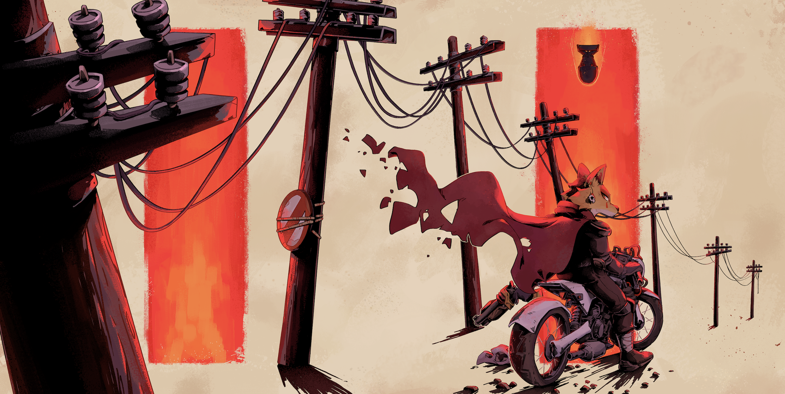
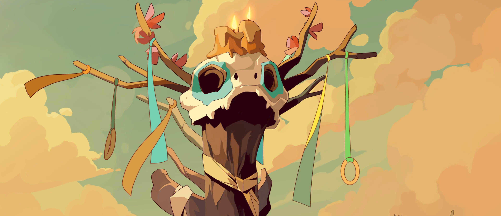

# STILL VERY MUCH EARLY IN DEVELOPMENT/PLEASE SEE BELOW
This project is actively being worked on and is ***NOT*** in any state to be used or attempted in an Archipelago game in any form. Ideally, this will be removed within the near future, but for now this shall remain until further notice.

# Laika:Aged Through Blood Archipelago Randomizer
A *Laika: Aged Through Blood* mod for the [Archipelago multi-game randomizer system](https://archipelago.gg).

# Status (as of April 2026)
Internal side for receiving checks is mostly complete in concept. 

Sending checks and Archipelago networking is the next step planned for the future.

# Contact
For questions, feedback, or discussion related to the randomizer, please visit the "`Laika: Aged Through Blood`" thread in the [Archipelago Discord server](https://discord.com/channels/731205301247803413/1491947867345129522), or message me (`@itsseras`) directly on Discord.

# What is an "Archipelago Randomizer", and why would I want one?

Archipelago allows for various games to be randomized in a vast amount of ways. Not only that, but Archipelago allows these games to link to each other and send various in game items to one another.

For example, say you're playing *Laika: Aged Through Blood* and buy a map upgrade from Renato. That map upgrade could instead give a legendary item to a *Risk of Rain 2* player in their game. In the same vein, the Risk of Rain 2 player could open a chest and send a Sniper Rifle to you in your game. This allows for unique and dynamic gameplay styles and a wide variety of approaching games that were not possible prior. 

# What This Specific Mod Changes
PLACEHOLDER/NA

# Installation
PLACEHOLDER/NA

# Other Suggested Mods and Tools
PLACEHOLDER/NA

# Credits

- @ndubs103 for proposing the idea in the `future-game-design` thread on the Archipelago Discord server.
- @ixrec for his inspirational support for the Nine Sols and Outer Wilds Archipelago. His work motivated me to look into working on AP modding (Plus, he's just a really cool cat!).
- @Rixor and everyone in *Paradise* who motivated me to continue working on the project.
- Everyone at *Brainwash Gang* who made this great game <3.
